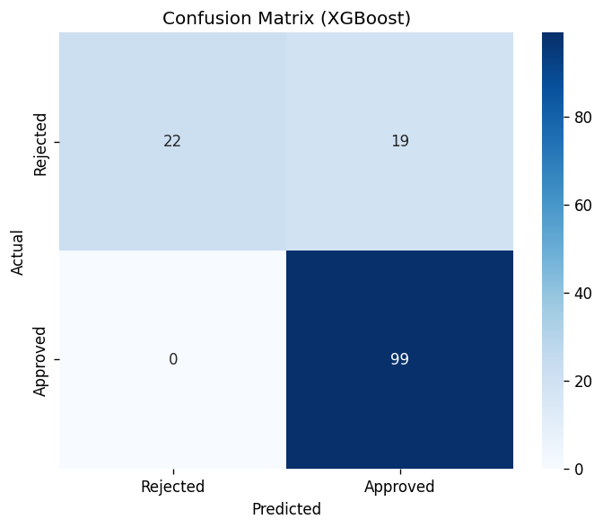
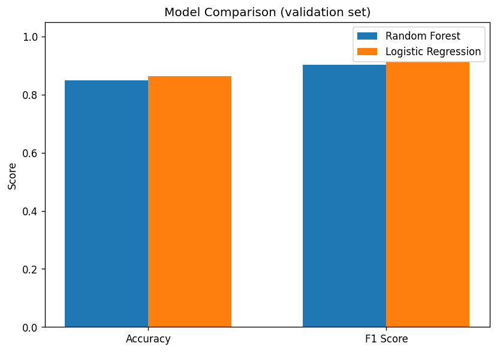

# Loan Approval Prediction

## Project Overview

A **loan approval prediction** system that helps banks automate the process of classifying loan applications as approved or rejected. The director of SZE bank needed to reduce the manual effort of reviewing applications; this project delivers an ML model and a web app so the bank can get instant predictions from applicant details.

**Objective:** Build a binary classification model and deploy it via a web application so the bank can quickly decide whether to grant or reject a loan.

---

## Dataset Description

- **Source:** Loan application data (train/test from [DPhi Datasets](https://github.com/dphi-official/Datasets)).
- **Training set:** `data/loan_train.csv` — **491 rows**, **13 columns** (excluding `Loan_ID`).
- **Test set:** `data/loan_test.csv` — **123 rows**, **12 columns** (no `Loan_Status`).

| Column | Description |
|--------|-------------|
| `Loan_ID` | Unique loan identifier |
| `Gender` | Applicant gender (Male/Female) |
| `Married` | Marital status (Yes/No) |
| `Dependents` | Number of dependents (0, 1, 2, 3+) |
| `Education` | Graduate / Not Graduate |
| `Self_Employed` | Yes / No |
| `ApplicantIncome` | Applicant income |
| `CoapplicantIncome` | Co-applicant income |
| `LoanAmount` | Requested loan amount (thousands) |
| `Loan_Amount_Term` | Term in days (e.g. 360) |
| `Credit_History` | 1.0 = good, 0.0 = bad |
| `Property_Area` | Rural / Semiurban / Urban |
| `Loan_Status` | **Target:** 1 = Approved, 0 = Rejected (train only) |

Missing values are present in several columns and are handled during preprocessing (e.g. imputation, encoding).

---

## Tech Stack

- **Python 3**
- **Pandas** — data loading, cleaning, and preprocessing
- **NumPy** — numerical operations
- **Scikit-learn** — train/validation split, metrics (`accuracy_score`, `f1_score`, `precision_score`, `recall_score`), `GridSearchCV`
- **XGBoost** — primary classification model
- **Joblib** — model serialization (`.pkl`)
- **Flask** — web app for prediction UI
- **Jinja2 / HTML / CSS** — templates and styling (Colorlib-style form)

---

## Model Performance

The chosen model is **XGBoost**, tuned with **GridSearchCV** (10-fold CV, refit on accuracy).

| Metric | Value |
|--------|--------|
| **Accuracy** | ~87.1% (validation) |
| **Recall** | ~84.6% |
| **Precision** | ~100% |
| **F1 Score** | ~91.7% |

Best hyperparameters (example): `eta=0.15`, `gamma=5`, `min_child_weight=1.5`, `subsample=0.61`, `colsample_bytree=0.72`.  
The deployed web app reports model accuracy of **around 83%** in production context.

---

## Output Screenshots

Project artifacts and visualizations are stored under `images/`:

| Asset | Description |
|-------|-------------|
| **Correlation heatmap** | Feature correlations in the training data. |
| **Confusion matrix** | Validation-set performance (TP, TN, FP, FN). |
| **Model comparison** | Comparison of model metrics (e.g. XGBoost vs baseline). |

### Images folder structure

```
├── images/
│   ├── heatmap.png           # Feature correlation heatmap
│   ├── confusion_matrix.png  # Confusion matrix plot
│   └── model_comparison.png  # Model performance comparison
```

**Correlation heatmap**


**Confusion matrix**



**Model comparison**



---

## How to Run the Project

### 1. Clone and setup

```bash
git clone <your-repo-url>
cd ml-project
```

### 2. Create a virtual environment (recommended)

```bash
python -m venv venv
# Windows
venv\Scripts\activate
# macOS/Linux
# source venv/bin/activate
```

### 3. Install dependencies

```bash
pip install -r requirements.txt
```

### 4. (Optional) Regenerate model and images

- **Model:** Open and run `notebook/Machine Learning Model Dev.ipynb` to retrain and save `bin/xgboostModel.pkl`.
- **Images:** From the project root, run:
  ```bash
  python scripts/generate_images.py
  ```
  This creates `images/heatmap.png`, `images/confusion_matrix.png`, and `images/model_comparison.png`.

### 5. Run the web app

From the project root:

```bash
python app.py
```

Then open **http://127.0.0.1:5000/** in a browser. Submit the loan application form to get an approval/rejection prediction.

### 6. Production (e.g. Heroku)

The repo includes a `Procfile` and `runtime.txt` for deployment. Use:

```bash
web: gunicorn app:app
```

---

## Project structure (summary)

```
├── app.py                 # Flask app and prediction API
├── requirements.txt
├── data/
│   ├── loan_train.csv
│   ├── loan_test.csv
│   └── columns_set.json   # Feature schema for the app
├── bin/
│   └── xgboostModel.pkl   # Saved XGBoost model
├── notebook/
│   └── Machine Learning Model Dev.ipynb
├── template/              # HTML templates
├── static/                # CSS, fonts, static images
├── images/                # Heatmap, confusion matrix, model comparison
│   ├── heatmap.png
│   ├── confusion_matrix.png
│   └── model_comparison.png
└── scripts/
    └── generate_images.py # Script to generate images/
```

---

## Web template

The UI uses HTML/CSS templates inspired by [Colorlib RegForm](https://colorlib.com/wp/template/colorlib-regform-7/).
